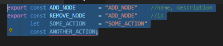
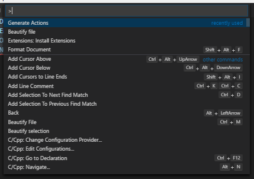
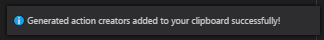
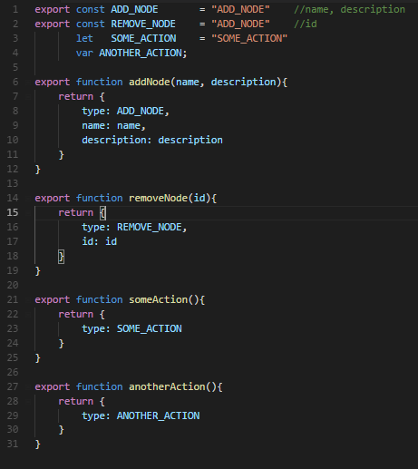

# action-generator

Generate action creators very quickly. [Click here to install.](vscode:extension/jvitoroc.action-generator)

## How it works

First, select your actions. If you want to add parameters to your actions, just start a comment section right after an action and separate your paramaters with commas, just like the image:

Second, run the command "Generate Actions Creators" (Ctrl+Shift+P)

Third, a pop up will come up (maybe in the bottom-right corner) telling you if the command ran successfuly:

Finally, paste your actions creators (Ctrl+V):

